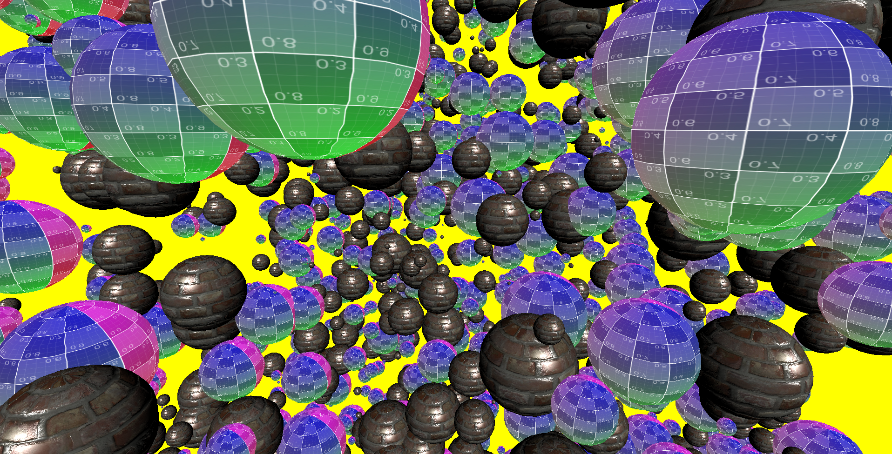

# webGPU study
These study samples run in Chrome Canary() behind the flag --enable-unsafe-webgpu.

# 

# study example
 - ## basic
    - [hello world](https://redcamel.github.io/webgpu/001_helloworld)
    - [uniform](https://redcamel.github.io/webgpu/002_transform)
    - [attribute](https://redcamel.github.io/webgpu/003_attribute)
    - [use multiply bindGroupLayout](https://redcamel.github.io/webgpu/009_multi_BindGroupLayout)
 - ## Texture
    - [basic texture](https://redcamel.github.io/webgpu/004_texture)
        - [clamp-to-edge](https://redcamel.github.io/webgpu/004_texture/clamp-to-edge)
        - [mirror-repeat](https://redcamel.github.io/webgpu/004_texture/mirror-repeat)
        - [repeat](https://redcamel.github.io/webgpu/004_texture/repeat)
 - ## multiple draw     
    - [draw multiple object - one buffer](https://redcamel.github.io/webgpu/005_multiObject)
    - [draw multiple object - individual buffer](https://redcamel.github.io/webgpu/005_multiObject2)
    - [instancing](https://redcamel.github.io/webgpu/008_instancing)
 - ## IndexBuffer
    - [indexBuffer - use drawIndexed](https://redcamel.github.io/webgpu/006_indexBuffer)
  - ## Lighting
    - [simple light test](https://redcamel.github.io/webgpu/007_simpleLight)
 - ## PostEffect
    - [simple PostEffect](https://redcamel.github.io/webgpu/010_postEffect)
 - ## Simple engine Test
    - [simple engine](https://redcamel.github.io/webgpu/simpleEngine)
    